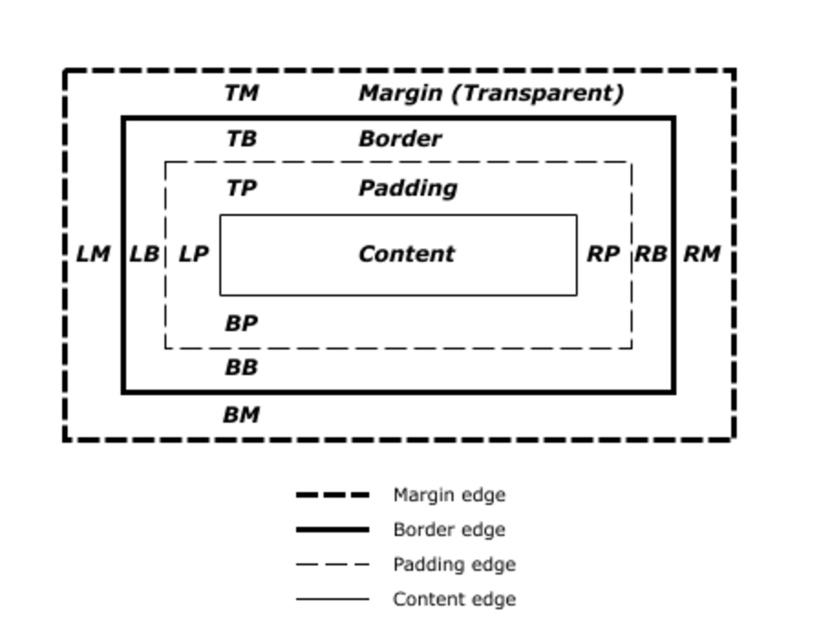

# Guide to Homework-1.3

This guide reviews some core concepts covered in [CodeAcademy Learn HTML & CSS: Part 1](https://www.codecademy.com/learn/learn-html-css), Section 5 "Organizing HTML & CSS" and Section 6 "The CSS Box Model".

Additionally, you may find the following reference materials useful:

* [HTML Dog Tag List](http://www.htmldog.com/reference/htmltags/)
* [W3Schools Tag List](http://www.w3schools.com/tags/default.asp)
* [HTML Dog HTML Tutorial](http://www.htmldog.com/guides/html/beginner/)
* [W3Schools HTML Tutorial](http://www.w3schools.com/html/)
* [HTML Dog CSS Reference](http://www.htmldog.com/references/css)
* [W3Schools CSS Reference](https://www.w3schools.com/cssref/default.asp)

### IDs

IDs and classes allow us to label specific elements, so that we can apply style to them.  Consider the following code:

```html
<h1 id="header">Header name</h1>
<h1>Another tag</h1>
<h1>And another</h1>
```
If we put this in our stylesheet...

```css
#header {
  color: #FFFFFF;
}
```
...then only the text in the first h1 will turn white.  

### Classes

IDs are designed to be used only once per page, whereas classes are designed to be used multiple times.  And instead of a #, they start with a . when used in a stylesheet.

```html
<h2 class="sectiontitle">First section</h2>
<h2 class="sectiontitle">Second section</h2>
<h2 class="nonsectiontitle">First non-section</h2>
<h2 class="nonsectiontitle">Second non-section</h2>
```

If we put this in our stylesheet...

```css
.sectiontitle {
  color: #FFFFFF;
}

.nonsectiontitle {
  color: #BADA55;
}
```

...the first two h2 tags will turn white, and the second two will turn green.

### Classes with elements
We can also target specific elements that have a given class by combining classes and elements.  For example:

```html
<h2 class="bodytext">First section</h2>
<p class="bodytext">Opening paragraph</h2>
```

If we put this in our stylesheet...

```css
p.bodytext {
  color: #FFFFFF;
}

```

...then the words "Opening paragraph" will turn green, but not the words "First section".

### Targeting multiple classes

The following bit of code...

```css
.one, .two {
  font-size: 24px;
}
```

...will make elements with either class (one or two) 24px.

Similarly, we can also apply two classes to a single element...

```html
<h2 class="one two">three</h2>
<h2 class="one">one</h2>
```

...and apply style from different parts of the stylesheet, like so:

```css
.one {
  font-size: 24px;
}

.two {
  color: #CCCCCC;
}
```

The words "three" and "one" will both be 24px, but only "three" will be turned grey.

### Divs

DIVs are the most commonly used HTML tags, forming the structure of most web pages. They are essentially empty containers to which styling can be applied, generally through the use of IDs and classes. They are also used to group together related elements.

```html
<div class="top">
  <h1>My Name</h1>
  <h2>my title</h2>
</div>
```

### The Box Model

All HTML elements are really invisible boxes, in which we can put text and images. And through CSS, we can control the size of the boxes, how close they sit to other boxes on a page, and where the content we place inside them sits.  There are four key parts of each HTML element box, as the image below shows.


(courtesy w3.org)

At the center is the **content**.  This can be text, an image or another nested HTML element.

The space between the content and the edge of the box is called **padding**.  We can control how big this space is, on all four sides: top, bottom, left and right, identified as TP, BP, LP and RP in the image above.  

The edge of the box is called the ** border**.  We can control the thickness, the color and the style (dashed, solid, etc...).

Finally, the space between the border and other HTML elements on a page is called **margin**.  As with padding, we can control the space on all four sides.

### Controlling Width and Height

We can control the size of HTML elements.  This bit of CSS code creates a box with a class of smallbox that's 100 pixels high and 200 pixels wide.

```css
.smallbox {
  height: 100px;
  width: 200px;
}
```

As with font sizing, we can also use percentages and ems to set an element's dimensions relative to the parent (or containing) element.

Consider the following code:

```html
<div class="outbox">
  <div class="inbox">
  </div>  
</div>
```

```css
.outbox {
  width: 200px;
}

.inbox {
  width: 50%;
}
```

The size of inbox is 100px, or 50 percent of the size of the parent element, outbox.  If you swapped out 50% for 0.5em, the result would be the same.

When we're building web pages, we normally use percentages or ems, because it results in pages that work more seamlessly on an array of different device widths.   But we frequently do so in combination with the min-width and min-height properties (and media queries, which will come later), to avoid super narrow boxes on mobile phones. Consider the following code:

```html
<body>
  <div class="head">
    Page information
  </div>
</body>
```

```css
.head {
  width: 50%;
  min-width: 300px;
}
```

Unless we explicitly set the body width in our stylesheet, it will vary between devices.  It might be 360px on a mobile phone, or 1200px on a desktop browser. If the body is 1200px, our head box will be 600px.  If the body is 360px, if we hadn't set min-width to 300 our head box would be 180px.  But min-width overrides that; our box will never get smaller than 300px.

###Controlling and Padding and Margin

There are several properties and methods to control padding and margin of a box.  We can target individual sides of a box, and we can use pixels, ems and percentages.

```css
.box {
  padding-left: 5px;
  padding-right: 10px;
  padding-top: 0px;
  padding-bottom: 3px;
  margin-top: 1em;
  margin-bottom: 10%;
  margin-left: 0.5em;
  margin-right: 4em;
}
```
Or we can target all four sides at once with the same value:

```css
.box {
  padding: 5px;
  margin: 10%;
}
```

Or we can target all four sides at once with different values. In this example, the first value (1px or 1em) refers to the top of the box, and moves clockwise (right 2px or 2em, bottom 3px or 3em, left 4px or 4em).

```css
.box {
  padding: 1px 2px 3px 4px;
  margin: 1em 2em 3em 4em;
}
```
Or we can target the top and bottom with the same value and left and right with the same value.  In this example, the first value (2px or 2em) sets the value for the top and bottom, and the second value (4px or 4em) for the left and right.

```css
.box {
  padding: 2px 4px;
  margin: 2em 4em;
}
```

### Centering with margin

To center a HTML element box horizontally, use `margin: auto;`.  Please note, this method will not work if the box is 100 percent of the width of its parent element.  And `margin: auto;` doesn't work to center elements vertically.  

```css
.box {
  margin: 0 auto;
}
```
In the above example, the top and bottom margin is set to 0, and the box will be centered horizontally.

### Display properties

By default, different HTML elements have different default properties that affect how they interact with other elements on the page. `<div>, <p>, <h1>, <li>` for example, are **block** elements, meaning they force other elements to go above or below them.  `<a> or <span>` tags or links, are **inline** elements, meaning they don't cause a line break.

But we can override these default behaviors with CSS. For example, it's how we can transform an unordered list from a vertical alignment, with one list item per line, to a horizontal alignment, with all items on the same line. Consider this list...

```html
<ul>
  <li>item one</li>
  <li>item two</li>
  <li>item three</li>
</ul>
```
...which looks like this by default:

* **item one |**
* **item two |**
* **item three**

If we add this bit of css...

```css
ul {
  margin:0;
  padding:0;
}

.menu li {
  display: inline;
}
```
...it now looks like this:

**item one | item two | item three**

The four values for display are inline, block (which can make a link behave like a DIV, for example), inline-block (a weird mashup of the two) and none (which totally destroys an element).

### Borders

There are lots of ways to style the border of a box, which is hidden, by default.  

**border-style** determines the kind of border.  The most common types are *solid and dashed*, but there are about 10 others.  

**border-color** determines the color.  You can use named colors, hex or rgb or rgba.

**border-width** controls border width.  Best to use pixes.

The most efficient way is to combine all three using the **border** property, like so:

```css
.box {
  border: 1px solid #cccccc;
}
```

You can also target individual sides, like so:

```css
.box {
  border-right: 1px solid #cccccc;
}
```

### The Border Box Sizing method

Under the default settings for HTML element boxes, calculating width can be challenging.  Let's say you create a box with the following styling:

```css
.box {
  height: 100px;
  width: 400px;
  padding: 5px;
  border: 5px solid black;
}
```
The width of the box is 400px, right? Wrong.  It's actually 400 pixels, plus 5 pixels of padding left, 5 pixels of padding right, 5 pixels of border left and 5 pixels of border right, for a total of 420px.

This happens because, by default, the **box-sizing** property is set to *content-box*.  But we can change it for the whole page, by setting it to *border-box*:

```css
* {
  box-sizing: border-box;
}

.box {
  height: 100px;
  width: 400px;
  padding: 5px;
  border: 5px solid black;
}
```
Once we do this, the total size of our box will be 400px wide.  There will still be 5px of padding on the left and right, and 5px of border on the left and right.  But the *border-box* model automatically adjusts the interior width of the box to 380px.  
