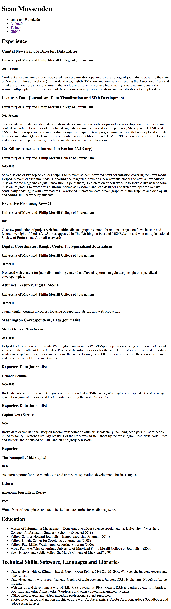

# In-class assignment 1.2

**How to submit:** Commit index.html to GitHub Pages site. Put link to GitHub pages site in ELMS.

## Getting started

* A. Open GitHub Desktop, and clone GitHub pages repo to your desktop.
* B. Open index.html in your repo in Atom on one side of the screen.
* C. Open index.html in Google Chrome on the other side of the screen.
* D. When you make changes in index.html in Atom, refresh index.html in Chrome to see changes. This is critical.  **Get into the habit of making a single change, and refreshing in the browser to check it.**
* E. Periodically commit changes on GitHub Desktop and sync to master.  

## Detailed instructions

When you're finished with this assignment, your resume should look essentially identical to the image at the bottom of this page.  Pay close attention to the following guidelines:  

* Start by writing valid HTML boilerplate (DOCTYPE, etc...).
* Title the page "Your Name Resume"
* Use the following tags for each part of the resume:
  * Name: Heading 1
  * Contact details(Email, LinkedIn, Twitter, GitHub): Unordered list; for LinkedIn, Twitter, GitHub, email should be linked to your profile on those sites.
  * Section Titles (Experience, Education, Skills): Heading 2
  * Job Titles: Heading 3
  * Job Organization: Heading 4
  * Job Dates: Heading 5
  * Job Description: paragraph
* In writing code, use proper indentation and spacing.
* As you build this page, make at least 3 commits and syncs to your repo on GitHub.

## Example resume

