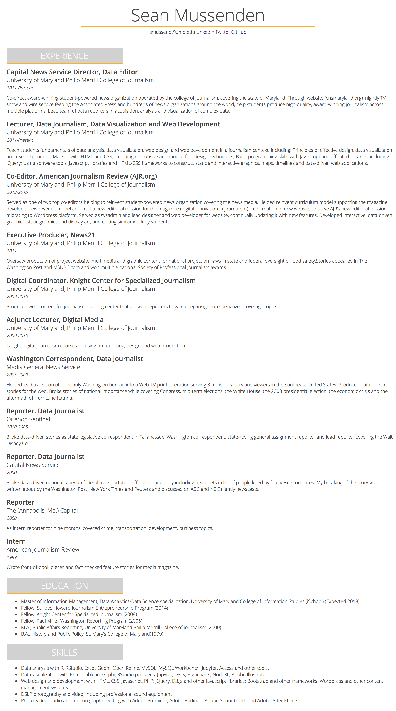
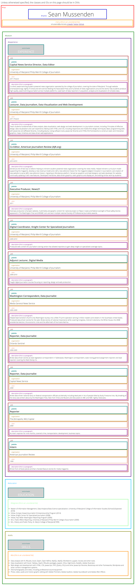

# In-class assignment 1.4

**How to submit:** Commit index.html to GitHub Pages site. Put link to GitHub pages site in ELMS.

## Getting started

* A. Open GitHub Desktop, and, if you're on a new computer, clone GitHub pages repo to your desktop. If you're on the same computer, sync.
* B. Open index.html in your repo in Atom on one side of the screen.
* C. Open index.html in Google Chrome on the other side of the screen.
* D. When you make changes in index.html in Atom, refresh index.html in Chrome to see changes. This is critical.  **Get into the habit of making a single change, and refreshing in the browser to check it.**
* E. Periodically commit changes on GitHub Desktop and sync to master.  

## Detailed instructions

When you're finished with this assignment, your resume should look essentially identical to mine in the first image below. Please note, the second image is there to help guide you as set about restructuring the page; your final product shouldn't be filled with colored boxes.

You have four main goals today:
* Replace all of the heading tags with DIVs
* Add classes and IDs to existing elements so that you can target them from your stylesheet.
* Improve the structure of the page by adding additional DIVs with classes and IDs to contain existing elements.
* When modifying your stylesheet to add classes and IDs, maintain existing styling while also adding margin, padding and borders as instructed.

Specifically, I want you to follow these instructions exactly:

#### General rules

* Using the universal selector, set the **box-sizing** property for the whole document to *border-box*.
* Set it so that **divs** also have a default boldness of 300.
* For each element that you change or add in your stylesheet, write a comment explaining what you did. (i.e. "changed h1 to #name, adjusted margin, added border." or "added this to contain elements at top of page.")
* When adding margin and padding, use the method that requires you to write four values unless using margin to center an element, than you can use two values.
* Pay very close attention to proper indentation and whitespace, which will become more important as we increase the complexity of our document.
* At the end, your HTML document and CSS file should have no references to heading tags.
* As you build this page, make at least 3 commits and syncs to your repo on GitHub.

#### Changing -- and adding to -- existing elements

* Change the **Heading 1 tags** in your html document and stylesheet to a **div with an ID of "name"**. Maintain the existing styling, while adding the following:
  * A solid border on the bottom only of 1 pixel with a color of #FDB020.
  * Set the margin on the top and bottom to 5px.  For the left and right, use margin to center the element.
  * Set the width at 60 percent and the minimum width at 300 pixels.
* Change the Heading 2 tags in your html document and stylesheet to a **div** with a class of "sectionheader". Maintain the existing styling, while adding the following:
  * A margin of 10 pixels on the bottom, and 0 on all other sides.
  * Align the text center (do not use the margin method for this)
  * Set the width at 30 percent and the minimum width at 150 pixels.
  * Add a bottom border that is solid, one pixel in width and is #FDB020.
* Change the Heading 3 tags in your html document and stylesheet to a **div** with a class of "jobtitle". Leave the styling as is.
* Change the Heading 4 tags in your html document and stylesheet to a **div** with a class of "organization". Leave the styling as is.
* Change the Heading 5 tags in your html document and stylesheet to a **div** with a class of "date".  Leave the styling as is, but set the margin at the top to 2 pixels, while setting all other margins to 0 pixels.
* Add a class of "description" to all of the paragraph elements on the page. Leave the styling as is, but set the margin at the top to 10 pixels, while setting all other margins to 0 pixels.
* Add a class of "menu" to the unordered list containing your contact information.  In your stylesheet, set the margin and padding for this list on all sides to 0px (you may use one value to do this for margin and padding), and align the text to the center. In a separate entry in your stylesheet, set the items in this list (and only this list) to display inline.
* Add an id of "degrees" to the unordered list in the education section. In your stylesheet, set the top margin to 5 pixels, while leaving all the other sides at 0.
* Add an id of "do" to the unordered list in the skills section. In your stylesheet, set the top margin to 5 pixels, while leaving all the other sides at 0.

#### Adding new elements

We're going to add several "container" divs to group together common elements.  This will make it easier to manipulate them as we move into subsequent lessons. For now, we'll just add margins.

Refer to the image below with the colored boxes as a guide.

* For each group of elements describing your experience (jobtitle, organization, date, details), surround it with a **div** with a class of "job".  In your stylesheet, set the bottom margin to 15 pixels, while leaving all other margins at 0 pixels.
* Create a **div** with an ID "experience".  Put the open tag just above the first "sectionheader" on the page, and close it just before the second "sectionheader" on the page.  In your stylesheet, set the bottom margin to 20 pixels, while leaving all other margins at 0 pixels.
* Create a **div** with an ID of "education". Put the open tag just below the div that closes "experience", and close it just before the third sectionheader on the page. In your stylesheet, set the bottom margin to 20 pixels, while leaving all other margins at 0 pixels.  
* Create a **div** with an ID of "skills". Put the open tag just below the div that closes "education", and close it after the closing tag for the unordered list. In your stylesheet, set the bottom margin to 20 pixels, while leaving all other margins at 0 pixels.
* Create a **div** with an ID of "top". Put the open tag just below the body tag. Put the closing tag after the "menu" unordered list closing tag.  In your stylesheet, set the bottom margin to 35px pixels, while leaving all other margins at 0 pixels.
* Create a **div** with an ID of "bottom".  Put the open tag just below the closing tag for "top". Put the closing tag just above the closing body tag. In your stylesheet, set the left margin to 10 pixels, while leaving all other margins at 0.

## Example resume

## Resume with colored labeled boxes to help you

