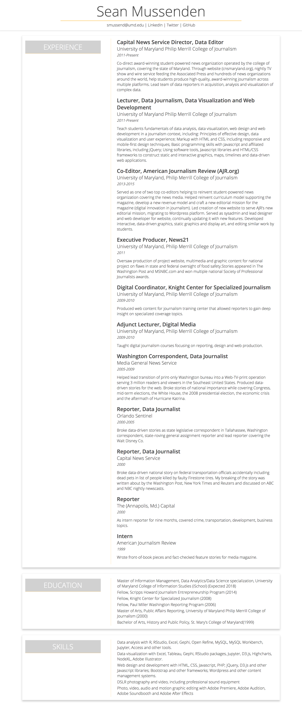

# In-class assignment 1.5

**How to submit:** Commit index.html to GitHub Pages site. Put link to GitHub pages site in ELMS.

## Getting started

* A. Open GitHub Desktop, and, if you're on a new computer, clone GitHub pages repo to your desktop. If you're on the same computer, sync.
* B. Open index.html and style.css in your repo in Atom on one side of the screen.
* C. Open index.html in Google Chrome on the other side of the screen.
* D. When you make changes in index.html and style.css in Atom, refresh index.html in Chrome to see changes. This is critical.  **Get into the habit of making a single change, and refreshing in the browser to check it.**
* E. Periodically commit changes on GitHub Desktop and sync to master.  

## Detailed instructions

When you're finished with this assignment, your resume should look essentially identical to mine. See the image at the bottom of the page.

Here's what I want you to do:

## index.html changes (Do these first)

* In the .contact section add a pipe (it looks like this: | ) after the word LinkedIn and Twitter. Instead of "LinkedIn" showing up on the page, you should have "LinkedIn |".
* You're going to add a new div with a class of *.alljobs* and use it to hold all of your individual *.job* divs.

## style.css changes (Do these second)

* **body** Set the margin and padding for the body at 0.
* **#top** We're going to make a sticky header that stays put as we scroll down the page.
  * change the bottom margin to 35 pixels, leave all other sides at 0.
  * set the padding on the bottom at 10 pixels, leave all other sides at 0.
  * make the background white.
  * set the width at 100 percent.
  * set the position of the element to the value that will make it stick to the top of the page.
  * set the z-index at 1.
  * add this bit of code, which you haven't learned yet, but will add a cool design element.  After you add it, google it, see if you can figure out what the different numbers mean.  Adjust them, and see what happens. `box-shadow: 0 1px 1px 0 rgba(0,0,0,0.2);`   
* **#bottom** For the body of the resume, we're going to center it and leave a gutter both edges.  We also need to push it down to make space for the fixed header.
  * Adjust the existing margin value to center this element, leaving the top and bottom margin set to 0.
  * Set the position of this element to relative.  
  * Push the element 120 pixels from the top.  Do NOT use margin to achieve this.
  * Set the width of the element to 95 percent.
  * Set `height: auto;`
  * Set `overflow: auto;`
* **.sectionheader** We're creating two columns in the body of the resume, with the section headers on one side (1/3), and the content on the other (2/3).  
  * Adjust the existing margin setting to make the top margin 7 pixels.
  * float the element to the left.
  * Change the existing #hex code (#FDB020) in the border-bottom property to rgba (not rgb), and set the opacity to 0.4.  Google to find a hex to rgb converter.
* **.alljobs** This new element contains all of the *.job* elements, which we use to create a 2/3 column on the right side of the page.  
  * Set the width to 65 percent.
  * float it to the left.
  * set the left margin at 4 percent. (Note that 4 plus 65 from .alljobs plus 30 from .sectionheader = 99%).
  * add a left border that is 1 pixel, solid and has the same rgba code as .sectionheader's border, but with opacity set to .3
  * add 20 pixels of padding to the left, with all other sides set at 0.
* **#experience, #education, #skills** We're going to create "cards" for each section of our resume, using a cool bit of drop shadow. In your stylesheet, combine #experience, #education and #skills into a single section of your stylesheet, and apply the following styles to all three:
  * set the top margin to 0 pixels, the bottom to 20 pixels, and use margin to center the element.
  * set padding on all sides to 10 pixels.
  * set the width to 90 percent.
  * set `height: auto;` and `overflow: auto;`.
  * set a border all around to solid, 1 pixel and #f2f2f2.
  * Add this nifty bit of box shadow, to give it definition: `box-shadow: 0 4px 8px 0 rgba(0,0,0,0.2);`
* **#degrees, #do** We need to make some adjustments to the lists in the education and skills sections, to match the columns in the education section above. In your stylesheet, combine #degrees and #do into a single section of your stylesheet, and apply the following styles to both:
  * Adjust the existing margin property to set the left margin to 4 percent.
  * Set the width to 65 percent.
  * Float it left.
  * Google which property to use to hide the bullets.
  * Drop in this bit of code: `-webkit-padding-start: 21px;`. What does it do?
  * Set a left border that is equal to the left border in the .alljobs div.   
  * Figure out how to put 3 pixels of space between each item in both lists.
* **.contact section**
  * Set the color of the links to #444, and figure out how to remove the underline from the links.  

