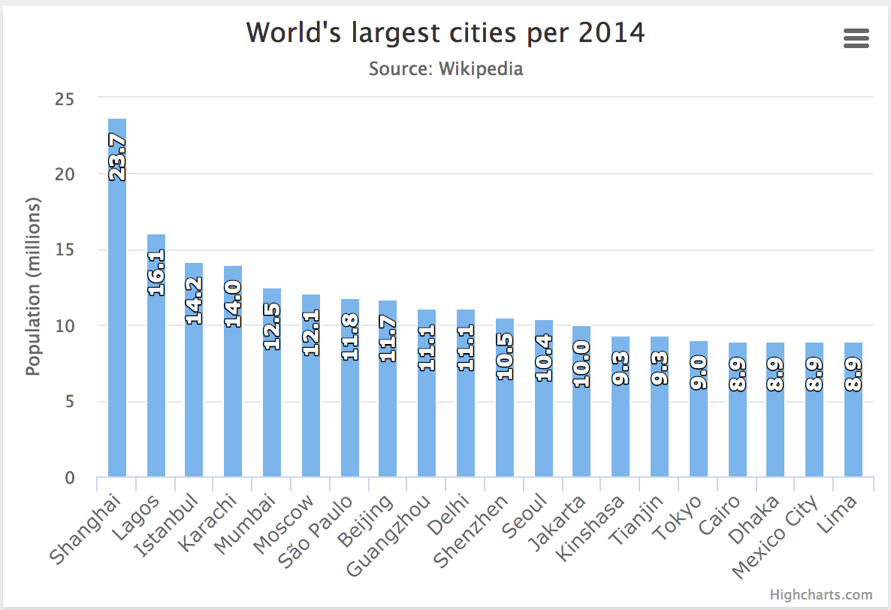
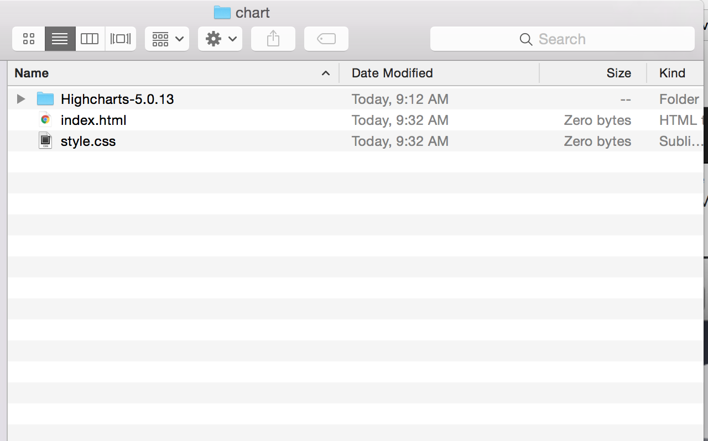
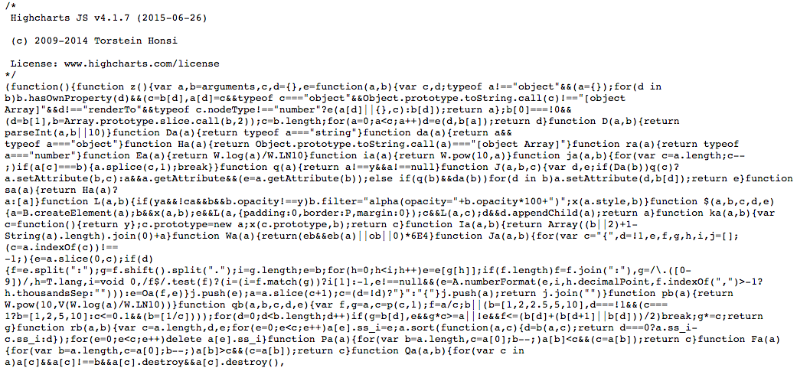
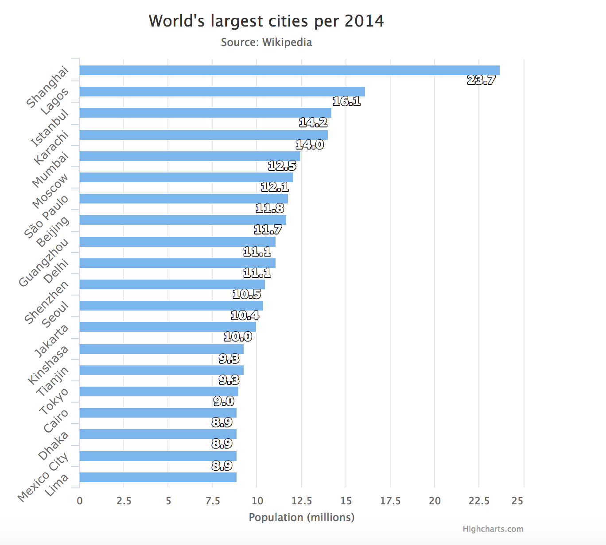

# In-class assignment 3.4

## Introduction to Javascript Libraries and Highcharts

Today we dip our toes into the waters of programming, by learning some very basic javascript using a pre-written package of code -- a "library" called Highcharts -- custom javascript, jquery, css and html -- that will help us make some charts.

## Intro to Javascript Libraries

Libraries are packages of code that make it easy to do complicated things without having to write a bunch of custom code yourself.

* Build basic charts and graphs (<a href="http://www.highcharts.com/">Highcharts</a>)
* Build INSANE charts and graphs (<a href="http://d3js.org/">D3</a>)
* Full screen background video (<a href="http://dfcb.github.io/BigVideo.js/">Bigvideo.js</a>)

Many developers host their libraries on <a href="https://github.com/">Github</a>.

The one we'll be using today is called <a href="http://www.highcharts.com/">Highcharts</a>.</strong>

## Step-by-Step with Highcharts

Today we'll be learning how to work with Highcharts to build this simple column chart showing population of the world's largest cities:



Along the way, we'll learn how to use libraries, use script tags and modify a javascript function.

### 1. Download Highcharts and Create Structure

Download the latest version of [Highcharts](http://www.highcharts.com/download)

Unzip the package and put it in a folder called "chart" into your germany-world-cup folder. Open your germany-world-cup project in atom.

Create a file called index.html in which you put the normal page structure of an HTML document.  Create an empty stylesheet called style.css and link to it from your HTML document.  

Your folder should look like this:


Your HTML document should look like this:
```html
<!DOCTYPE html>
<html>
<head>
  <link rel="stylesheet" type="text/css" href="style.css">
</head>
<body>
</body>
</html>
```
If we think about the process of building our chart as the process of building a car, we've just built the frame for the car, put on the wheels and doors, but we haven't yet put in the engine that makes it go.  That comes next.

### 2. Linking HTML Document to Highcharts Library and jQuery
Next, we need to link our HTML document to the Highcharts library we've downloaded. This will look similar to linking to a stylesheet, but instead of `<link>` we'll use a new kind of tag called `<script>`

We should think of these as the engines of the car we're building, the thing under the hood that makes the car go. And just like a car engine, this libraries is VERY complicated. Take a look at the [code for the Highcharts library](http://code.highcharts.com/highcharts.js). This is just the first few lines of highcharts.js:


Unless you're an experienced programmer, I'm guessing that looks like Greek to you. But luckily, we don't need to know exactly what that stuff means to use Highcharts, in much the same way that we don't need to know how exactly an engine works -- or be able to build one -- in order to drive a car. We just need to know that it goes under the hood and if it isn't there the car won't work.

We put javascript files at the bottom of the page right before the closing body tag, generally, because they're slow to load sometimes and putting them at the bottom speeds up page performance.

Add the links to jQuery and highcharts to your document. This is what your index.html file should look like now:

```html
<!DOCTYPE html>
<html>
<head>
  <link rel="stylesheet" type="text/css" href="style.css">
</head>
<body>
  <script src="Highcharts-5.0.13/code/highcharts.js"></script>
</body>
</html>
```

Note: Highcharts-5.0.13 was current when I wrote this tutorial, so the path to the Highcharts folder I downloaded is Highcharts-5.0.13/code/highcharts.js.  If your folder is named something different (i.e. Highcharts-5.1.2), you should change your path accordingly.

### 3. Add an Empty Box to Hold the Highchart
If we were building a chart with HTML and CSS, we might have dozens of DIVs on our page, with different classes and ID names, and corresponding information in our stylesheet.

But we're going to use Javascript to build the chart, so all we need is an empty container DIV and, in our stylesheet, tell it how wide to be and how tall.

So, make your index.html file look like this:

```html
<!DOCTYPE html>
<html>
<head>
  <link rel="stylesheet" type="text/css" href="style.css">
</head>
<body>
  <div id="container"></div>
  <script src="Highcharts-5.0.13/code/highcharts.js"></script>
</body>
</html>
```

And make you stylesheet look like this:

```css
body {
  max-width: 600px;
}

#container {
  width: 100%;
  height: 600px;
}

```

If you open your index.html file in a browser right now, you should see nothing, because we haven't told it what kind of chart to draw.

Keeping with our car analogy, we've now built the frame; dropped in the engine; and by creating a container DIV we've typed a destination into our GPS.  But we haven't yet given it any gas, or turned the wheel to get it to that destination.  We'll do that next.

### 3. Write a Function to Tell Highcharts What Kind of Chart to Make

Next, we write a function that tells Highcharts what kind of chart to draw.

A function is simply a set of step-by-step instructions to the computer to do something specific, in the same way a recipe is a set of step-by-step instructions telling a chef to make a specific meal.

You're not going to write a function from scratch today.  You're going to copy one someone has already written and modify it a little bit.  In our car analogy, think of this as using directions someone has already written to get somewhere, instead of coming up with your own route on the fly.

Remember, we're building this chart:


This chart is an [example from the Highcharts website](http://www.highcharts.com/demo/column-rotated-labels), a pre-written function. If you [visit this page](http://www.highcharts.com/demo/column-rotated-labels), and click the "view options" button you can see the function. Copy the code in the pop-up window in its entirety.

In your index.html document, below the Highcharts and jQuery script tags, write an opening script tag and a closing script tag like so:

```html
<!DOCTYPE html>
<html>
<head>
  <link rel="stylesheet" type="text/css" href="style.css">
</head>
<body>
  <div id="container"></div>
  <script src="Highcharts-5.0.13/code/highcharts.js"></script>
  <script>
  </script>
</body>
</html>
```

Between the open script tag and the closing script tag, paste in the function you copied from the Highcharts website like so:

```html
<!DOCTYPE html>
<html>
<head>
  <link rel="stylesheet" type="text/css" href="style.css">
</head>
<body>
  <div id="container"></div>
  <script src="Highcharts-5.0.13/code/highcharts.js"></script>
  <script>
    Highcharts.chart('container', {
      chart: {
          type: 'column'
      },
      title: {
          text: 'World\'s largest cities per 2014'
      },
      subtitle: {
          text: 'Source: <a href="http://en.wikipedia.org/wiki/List_of_cities_proper_by_population">Wikipedia</a>'
      },
      xAxis: {
          type: 'category',
          labels: {
              rotation: -45,
              style: {
                  fontSize: '13px',
                  fontFamily: 'Verdana, sans-serif'
              }
          }
      },
      yAxis: {
          min: 0,
          title: {
              text: 'Population (millions)'
          }
      },
      legend: {
          enabled: false
      },
      tooltip: {
          pointFormat: 'Population in 2008: <b>{point.y:.1f} millions</b>'
      },
      series: [{
          name: 'Population',
          data: [
              ['Shanghai', 23.7],
              ['Lagos', 16.1],
              ['Istanbul', 14.2],
              ['Karachi', 14.0],
              ['Mumbai', 12.5],
              ['Moscow', 12.1],
              ['São Paulo', 11.8],
              ['Beijing', 11.7],
              ['Guangzhou', 11.1],
              ['Delhi', 11.1],
              ['Shenzhen', 10.5],
              ['Seoul', 10.4],
              ['Jakarta', 10.0],
              ['Kinshasa', 9.3],
              ['Tianjin', 9.3],
              ['Tokyo', 9.0],
              ['Cairo', 8.9],
              ['Dhaka', 8.9],
              ['Mexico City', 8.9],
              ['Lima', 8.9]
          ],
          dataLabels: {
              enabled: true,
              rotation: -90,
              color: '#FFFFFF',
              align: 'right',
              format: '{point.y:.1f}', // one decimal
              y: 10, // 10 pixels down from the top
              style: {
                  fontSize: '13px',
                  fontFamily: 'Verdana, sans-serif'
              }
          }
      }]
  });
  </script>
</body>
</html>

```
Refresh your index.html file in a browser and you should see the chart!

### Breaking down the function

Let's look at what the function is doing.  The first line says "use the highcharts library to draw a chart inside of a div called container".  

```html
  Highcharts.chart('container', {
```

The rest of the function is a specific set of instructions on how exactly to draw the chart.  It tells us what kind of chart (column), what title to use, what data to use, et cetera. And the last three lines close the function.

One important note: if the div where we wanted to draw the chart had an ID of population, this is how our function would start.

```html
  Highcharts.chart('population', {
```

### Writing and editing Highcharts functions
Down the road, you'll be able to write your own functions from scratch.

For now, whenever you set out to build a Highchart, I'd suggest looking through the [list of examples](http://www.highcharts.com/demo) of chart types and finding the closest one to your final product and use it as a starting point.

From there, you can set about changing, adding or taking away attributes to make your chart look like you want.  

[Highcharts API reference](http://api.highcharts.com/highcharts) has a long list of attributes you can change and examples.

For example, let's say I wanted to change this from a column chart -- with vertical bars -- to a bar chart -- with horizontal bars and make the numbers on top of the bars rotated the right direction, like so:



I would need to make two small changes from the existing code.

First, I'd change this:

```html
chart: {
    type: 'column'
},
```
to this

```html
chart: {
    type: 'bar'
},
```

Then I'd change the orientation of the data labels from this:

```html
dataLabels: {
    enabled: true,
    rotation: -90,
    color: '#FFFFFF',
    align: 'right',
    format: '{point.y:.1f}', // one decimal
    y: 10, // 10 pixels down from the top
    style: {
        fontSize: '13px',
        fontFamily: 'Verdana, sans-serif'
    }
```

to this:

```html
dataLabels: {
    enabled: true,
    rotation: 0,
    color: '#FFFFFF',
    align: 'right',
    format: '{point.y:.1f}', // one decimal
    y: 10, // 10 pixels down from the top
    style: {
        fontSize: '13px',
        fontFamily: 'Verdana, sans-serif'
    }
```

There are hundreds of things you can tweak, by looking at the [Highcharts API reference](http://api.highcharts.com/highcharts). Most of them come with a link to example code on a site called JS fiddle, where you can look at them in action. Here's one example, of [how to change background color](http://jsfiddle.net/gh/get/jquery/1.7.2/highslide-software/highcharts.com/tree/master/samples/highcharts/chart/backgroundcolor-color/).

### Submission

Commit changes and push to your GitHub repo.  Submit a link to the index file in your chart folder on ELMS.
